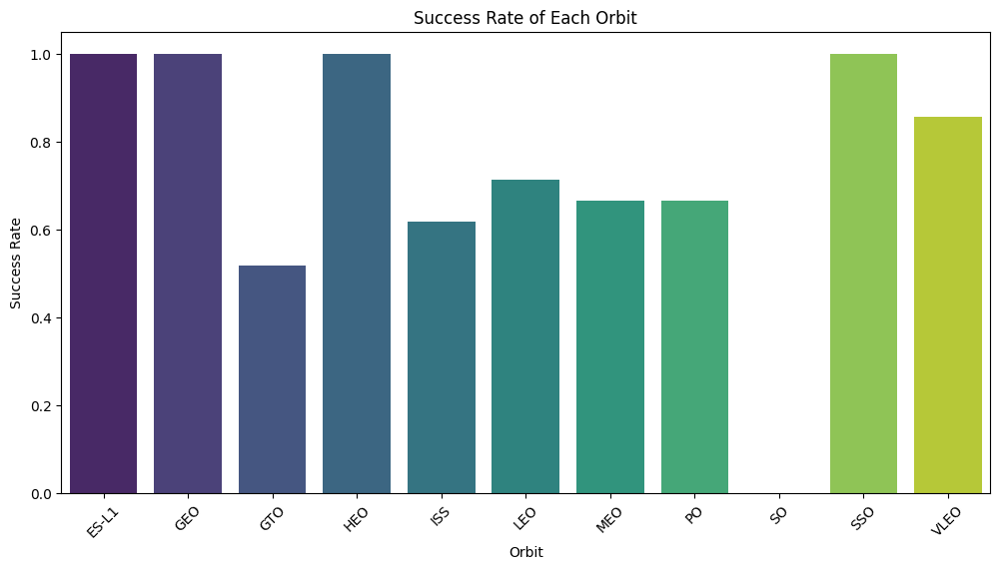
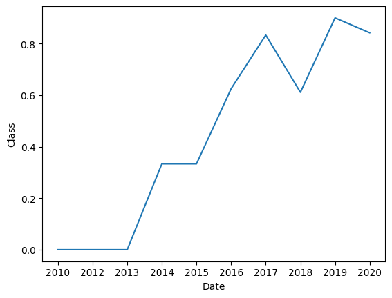
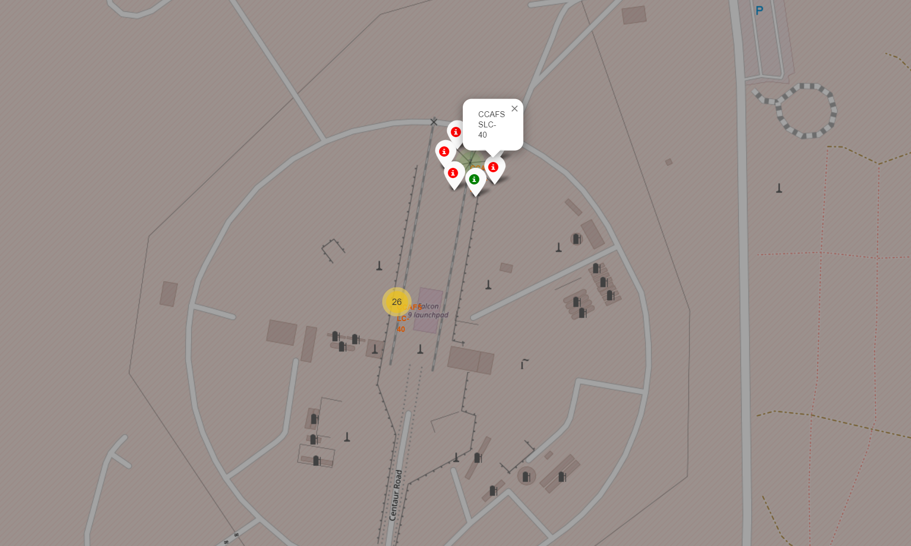
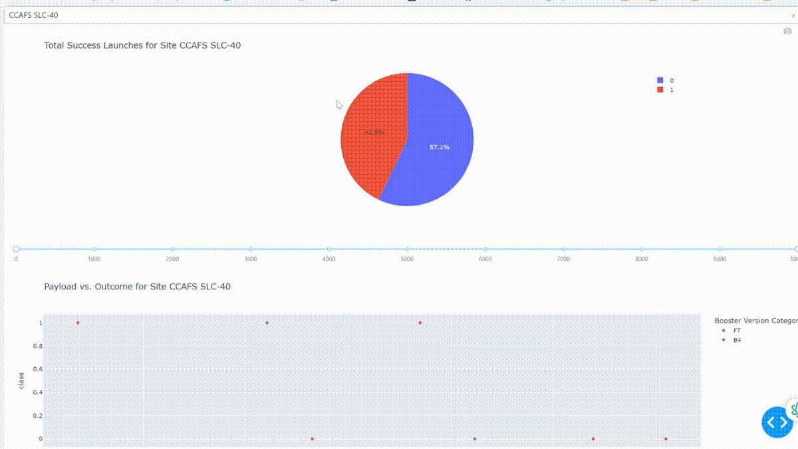
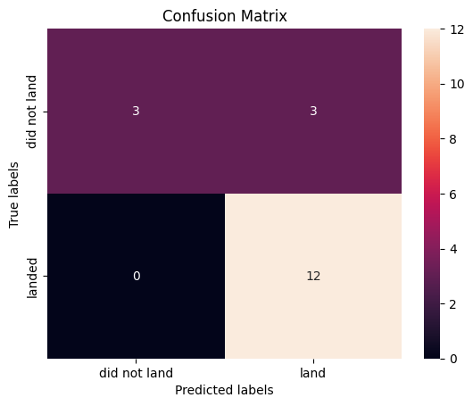

## 🛠️ Tools and Technologies Used


## 📊 Exploratory Data Analysis (EDA)

In this project, I performed extensive exploratory data analysis to understand the nuances of SpaceX launch outcomes. Below are the key steps taken:

### 1. **Web Scraping**

- Utilized Python libraries to extract raw launch data from various sources.

### 2. **Data Wrangling**

- Cleaned and structured the raw data into a usable format using Pandas, ensuring accuracy and consistency for subsequent analysis.

### 3. **EDA with SQL**

#### Landing Outcome Distribution (2010-2017)
A key SQL query used in the analysis to understand the distribution of landing outcomes:

```sql
SELECT landing_outcome, count(*) as outcome_count
FROM SPACEXTABLE
WHERE Date BETWEEN '2010-06-04' AND '2017-03-20'
GROUP BY landing_outcome
ORDER BY outcome_count DESC
```
Output:
| Landing_Outcome | Outcome_Count |
|-----------------|---------------|
| No attempt	    | 10 |
| Success (drone ship)	| 5 |
| Failure (drone ship)	| 5 |
| Success (ground pad)	| 3 |
| Controlled (ocean)	| 3 |
| Uncontrolled (ocean)	| 2 |
| Failure (parachute)	| 2 | 
| Precluded (drone ship)	| 1 | 

### 4. EDA Part 2
#### Success Rate of Each Orbit
Using the cleaned data, I analyzed the success rate for each orbit type. The bar chart below illustrates the success rates:

This chart shows the success rate of launches to different orbits, providing insights into the reliability of various orbital missions.

#### Trend of successful launches over time:

The line plot highlights how the success rate has evolved over the years, reflecting SpaceX’s growing proficiency in launch operations.

### 5. Geographical Mapping with Folium
Created interactive maps to visualize launch sites and their respective landing outcomes, leveraging the power of Folium for geographical representation.

### 6. Dashboard Development with Dash and Plotly
Developed a dynamic dashboard using Dash and Plotly to provide interactive visualizations and predictive analytics for SpaceX launches.

### 7. Machine Learning for Landing Prediction

#### 🔍 Machine Learning Models

Several machine learning algorithms were utilized to predict the landing outcomes:

1. **Logistic Regression**:
   - Logistic Regression was used to model the probability of a rocket landing successfully. The model's hyperparameters were fine-tuned using `GridSearchCV` to achieve optimal performance.
   - **Test Accuracy**: 0.8333

2. **Support Vector Machine (SVM)**:
   - A Support Vector Machine was trained to classify the landing outcomes, leveraging the kernel trick to handle non-linear relationships in the data.
   - **Test Accuracy**: 0.8333

3. **Decision Trees**:
   - A Decision Tree model was implemented to capture the decision-making process in predicting landing outcomes, with hyperparameter tuning via `GridSearchCV`.
   - **Test Accuracy**: 0.7222

4. **K-Nearest Neighbors (KNN)**:
   - The K-Nearest Neighbors algorithm was employed to predict landing outcomes based on the similarity of new data points to the existing labeled data.
   - **Test Accuracy**: 0.8333

#### 🧠 Model Performance
| Model | Test Accuracy |
|-------|---------------|
| Logistic Regression | 0.8333 |
| Support Vector Machine | 0.8333 |
| Decision Trees | 0.7222 |
| K-Nearest Neighbors | 0.8333 | 



The results indicate that the Logistic Regression, SVM, and KNN models all performed equally well, achieving an accuracy of 83.33% on the test data. The Decision Tree model, while slightly less accurate, still provided valuable insights with an accuracy of 72.22%.
